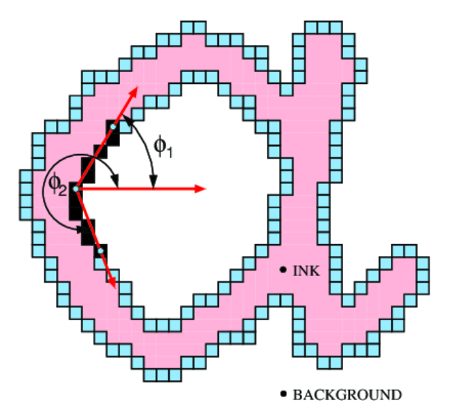
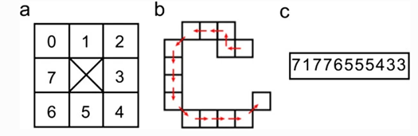

# Glassifier (Gender Classifier)

## Handwriting Based Gender Classifier

## Introduction to the problem

The challenge of automatically classifying gender based on handwritten samples allows distinguishing between male and female writers' samples. According to several psychological research, we can differentiate between the two genders' writings due to various differences; in average, female handwritings are more uniform and regular, whereas male handwritings are spikier and slanted.

Handwriting is an important piece of evidence that is examined in the questioned document to ensure its authenticity. Handwriting is the written speech of an individual who has characteristics that set him apart from others. It is a learned skill and a complex perceptual-motor task, also known as a neuromuscular task.Visual observation, outline conception, central nervous system pathways, and the anatomy and physiology of the bones and muscles of the hand and arm all work together to produce the desired output. Writing is a function of the conscious and subconscious mind, as well as of the body's motor, muscular, and nerve movements.Handwriting has distinct characteristics that are unique to each individual and can be used for personal identification.

In an extended handwriting sample, no two people write exactly alike, according to the basic principle of handwriting identification. The possibility of distinguishing the gender of the writer from his/her handwriting has been the pursuit of many investigations. Handwriting is said to be brainwriting, so the thinking of a male differs greatly from that of a female due to hormonal involvement and differences in their physiology, which may not only alter their neuromotor functioning, as a result of which writing work is done but also their way of thinking differs and thus characteristic. So handwriting which is observed during the examination may be proven to be showing discriminatory features in male and female handwriting.

## System Modules

### Preprocessing

The input to the data preprocessing module is the path of the image to be preprocessed then the image is read and preprocessed and we pass it to the feature extractor (so that we don’t have to store all the preprocessed images to minimize the program memory).

### Feature extraction

#### Hinge Feature

It capture information about the curvature and slant / angle of line at the point of intersection between two lines. This is done by computing the joint probability distribution of the orientations of the two legs. This extractor has 2 parameters. The length of each leg, and the number of angle bins. In our implementation we obtain legs by finding all contours in the image, then we filter out any contours shorter than 25 pixels. We then compute the angles between each two neighboring contours and construct a histogram using the angles 1, 2 as shown in the following figure.

  

#### Chaincode Feature
Firstly, we find contours of the image, then we traverse through their pixels while saving the direction we go through, each direction is then mapped to a number, the resulting number is then called ‘chain code’ of this contour.

Chain codes are then stored in a list for each image as shown in the figure below.

  

The extracted features are PDFs of the patterns encountered, for example: 
PDF[‘5’]  -> probability of ‘5’ in all chain codes of the image
PDF[‘53’] -> probability of ‘5’ followed by ‘3’ in all chain codes the image
This is done to all possible patterns up to a length of 3.
Total number of features:
8 for length 1
64 for length 2
512 for length 3
i.e.: a total of 584 numbers composes the chain code feature vector

#### Notes about Feature Extraction

The features (hinge & chaincode features) are extracted from the preprocessed image and stored in numpy arrays. We save the numpy arrays into external .npy files in the “Saved Data” directory (.npy files are used to store numpy arrays in binary format efficiently) so that we can load them directly into numpy arrays without waiting for feature extraction of the training dataset each time we run the program.

### Machine Learning Model

The used ML model is SVM classifier with the following parameters:
kernel = rbf (defualt) [Radial Basis Function is a kernel that allows curving in the separator]
C = 10 [This parameter controls the penalty for a miss-classification]

## Side Notes about the Project
1. The features of the training dataset are already saved in the "Saved Data" directory
2. To download the training dataset and re-extract the features, you can open "Training Dataset/structure.txt"
3. If an external test dataset is used, the images should be in jpg format
4. If an external test dataset is used, there should be a text file named "labels.txt" in the dataset directory that specifies the correct classification of the each image (the format of the file can be found at "Training Dataset/labels.txt" (note '1' is used for male and '0' is used for female))

## Run the Project

Open a command terminal window

`git clone https://github.com/mostafa-elgendy22/Glassifier.git`

`pip install -r requirements.txt`

`cd Glassifier/Code/`

If you want to split the training dataset to create the test dataset, then use the following command (Note: use forward slashes in all the directories because  the '\' acts like an escape character):

`python predict.py "path/to/output/directory/" -s test_dataset_size`

For example (to split the training dataset such that 35% of it becomes the test dataset):

`python predict.py "D:/classify/" -s 0.35`

If you want to provide an external test dataset, then use the following command:

`python predict.py "path/to/output/directory/" -k 'path/to/test/dataset/directory/`

For example:

`python predict.py "D:/classify/" -k "D:/test/"`

## References

https://link.springer.com/chapter/10.1007/978-3-030-51935-3_25

https://ieeexplore.ieee.org/document/6977065

https://jivp-eurasipjournals.springeropen.com/articles/10.1186/1687-5281-2014-10#:~:text=Classification%20rates%20are%20reported%20on,and%2047.98%25%20for%20nationality%20prediction"